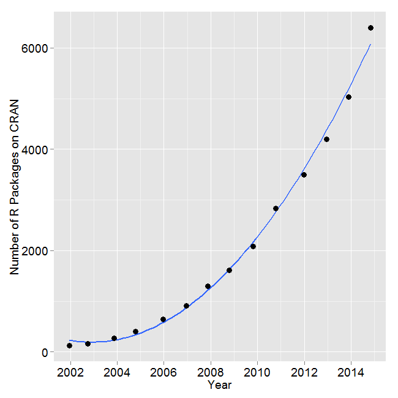

<style>
.title-slide hgroup h1 {color: red;}
h2 {color: red;}
slides > slide:not(.nobackground):after {
  content: '';
  
}

body > slides {
    padding: 0;
    margin: -100px -75px 0 0px;
}

slides > slide {
  width: 1000px;
  height: 1000px;
  padding: 10px 20px;
  left: 45%;
  top: 45%;
}
iframe {
  height: 1000px;
  width: 1200px;
}
</style>


```{r setup, include=FALSE}
knitr::opts_chunk$set(echo = FALSE)
library(knitr)
# install.packages('printr', type = 'source',repos = c('http://yihui.name/xran', 'http://cran.rstudio.com'))

library(gridExtra)
```

## Outline

* ABCD Model
* Gonzaga MAPS Project
* Assets
* Interactive Visualizations: Open-Source R
* Conclusion and R-Resources

Presentation link: [https://tinyurl.com/zagMAPS](https://tinyurl.com/GonzagaMAPS)

Presentation code: [https://tinyurl.com/zagMAPScode](https://tinyurl.com/zagMAPScode)

## ABCD

**Assets-based Commmunity Development**: Place-based framework pioneered by McKnight and Kretzmann (1993)

At a micro-level:

* People have gifts (hand, heart, head)
* People care about something
* That caring and passion motivates action


At a macro-level

* Neighborhoods and communities are built on the strengths and capacities of citizens and assets from the neighborhood
* Assets can be identified and mobilized to build community and create change
* Place-based approach that is relationship-driven and promotes resident engagement 

`r include_graphics("assets.png")`


## Asset Mapping

1.	Create resident leadership team (includes connectors/opinion leaders)
2.	Identify initial neighborhood boundaries
3.	Draws initial asset map of neighborhood… tape the geographic map on a wall and draw boundaries and assets… (typically physical that are already known)
4.	Creates a gifts-survey to id gifts and passions of residents
5.	Conduct in-person conversations with residents to identify resident gifts and passions (non-probability sampling approach used)
6.	Resident leadership team adds residents to the asset map.
    *	group surveys by what people care about – motivation for action 
    *	different colored sticky dots to each passion
    *	write residents name on sticky dot and place it on map where they live
7.	Resident leadership team connects residents that live close together with same passions and ask them to come together to share their gifts to accomplish something related to their passion. 
8.	Grow connections – people, associations and organizations

Source: Dan Duncan: [Asset Mapping toolkit from ABCD Institute, DePaul University](https://resources.depaul.edu/abcd-institute/resources/Documents/D.%20Duncan%20Asset%20Mapping%20Toolkit%20Eight%20Steps%20to%20Increase%20Residential%20Engagement.pdf), Retrieved July 22, 2019.

## Gonzaga MAPS Project

**Mapping Assets and Promoting Strengths**

Support NE Spokane neighborhoods through the process involving asset map creation to identify strengths, assets, and potential areas for collective action

### Demographics

* 67% of houses in the neighborhood are rentals
* In 2012, the average household income was \$27,333, 32% less than the median income in Spokane (\$39,990)
* 38.7% of the population lived under the federal poverty line (compared to 18.4% citywide, in 2012)

18 month long project, funded by City of Spokane, Raskob Foundation, and Gonzaga University


## Deliverables and Outcomes of MAPS

* Interactive map of assets
* Database of asset profiles, individuals
* Community conversations about the results
* Intentional connections with other collective action initiatives (The Zone; Spokane Regional Health District’s “Neighborhood Matters”)
* Enhancement of University capacity to engage in community impact efforts

## Assets

* Data on 1321 inventory items: interactive map and an interactive table. 

* 78 Associations, 19 Individuals, 175 Institutions, 780 assets from the Local Economy, and 269 Physical Spaces, which include 7 proposed or existing bike routes

[GU MAPS Visualization](https://analytics.gonzaga.edu/MAPSProject-combo/)


## Additional work

* Identify characteristics that residents of the Logan neighborhood believed were important for **any** good neighborhood. 
* Evaluation of the Logan neighborhood in terms of these important characteristics
* These results are based on surveys of 788 residents of the Logan neighborhood that were conducted in the first half of 2016.

## Importance of issues

<iframe src="ImportanceofIssues.html" frameBorder="0"></iframe> 

## Mean Scores of Importance of Issues and Rating of Logan on Them

<iframe src="Meansofimportanceandrating.html" frameBorder="0"></iframe> 

## Geographic Dispersion of Issues and Visualization of Hot-Spots
								
[Geographic Dispersion](https://analytics.gonzaga.edu/GUMaps-IADashboards/)
						

## What is R?

`r include_graphics(c("jchambers.jpg","small-ihaka.gif","small-robert.gif"))`


1. A language and an environment for statistical computing and graphics
2. Based on **S** - now owned by TIBCO 
3. Elegance - Language for statisticians by statisticians


`r include_graphics("Rlogo.png")`


## Pluses

1. Free and Open Source -No reinvention of wheel and tinkering opportunities
2. Coding in R - Reproducibility 
3. Routines generally appear in R before any other statistical system

<center></center>
Source: [Muenchen, Robert A, The Popularity of Data Analysis Software.](http://r4stats.com/articles/popularity/), Retrieved 8/29/2016


## Pluses Continued...

4. Graphics - Great.... to ....Mindblowing
5. Excellent package distribution system - Internet
6. Compatible with most flavors of Unix, Mac OSX, and Windows
7. Connectivity with database systems, import from different data formats
8. Community support is outstanding - user-base estimates of 250,000-2 million

<a href= "http://www.nytimes.com/2009/01/07/technology/business-computing/07program.html" target= "_blank"> Ashlee Vance's NY Times story of 2009</a></small>


## Limitations of R

1. Command line interface 
2. Help - IDEs: R Studio, Revolution Analytics and - GUI: Deducer and R Commander
3. Provides complete control over what happens but the learning curve could be steep

### Other Softwares - (SPSS, SAS, Stata,...)

1. Proprietory
2. Algorithms developed for users - tinkering/customization ability limited
3. Rectangular datasets and one at a time 
4. Expensive and costs escalate for additional options 

## Resources for packages used

* `plotly`: R package for linking to plotly JS library: [https://plot.ly/r/](https://plot.ly/r/)
* `DT`: R package for linkage to the DataTable JS library: [https://rstudio.github.io/DT/](https://rstudio.github.io/DT/) 
* `leaflet`: R package for linkage to leaflet JS library: [https://rstudio.github.io/leaflet/](https://rstudio.github.io/leaflet/)
* `shiny`: [https://www.rstudio.com/products/shiny/](https://www.rstudio.com/products/shiny/)


## Outcomes of Gonzaga MAPS

* Improved understanding by community members (Over 11 presentations to community partners, attended by over 2400 people)
* Shifts some of the responsibilities from resident leadership teams to residents, further improving engagement
* Reproducibility of code makes visualizations easily adaptable to other locations

* Increased faculty and student engagement in the neighborhood
* Building of capacity for faculty-engaged collective action, research and course development

* Cost of software used to develop the visualizations: **practically zero**
* Volunteered my time

<br><br><br>

### Questions?
